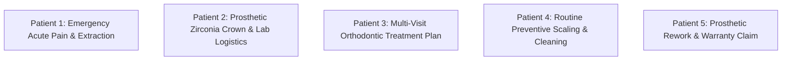
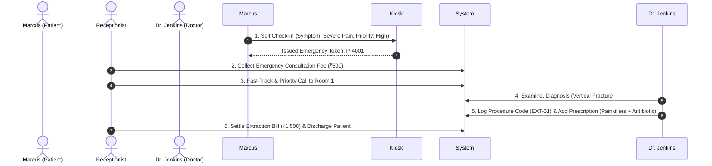

# 5 Complete Patient Workflow Test Cases
## SmileCare Dental Management System

This document details **5 distinct, end-to-end patient workflow test cases** representing real-world dental clinical scenarios, from initial patient entry to final discharge and financial clearance.

---

## 🗺️ Summary of 5 Patient Workflows

---

## 🧪 Patient Workflow 1: Emergency Walk-In (Severe Acute Pain & Extraction)
> **Scenario**: Patient arrives with severe acute toothache requiring emergency priority intake, examination, tooth extraction, and instant discharge.

### Patient Profile
- **Name**: `Marcus Vance` | **Age**: 42 | **Gender**: Male | **Phone**: `9876543210`
- **Chief Complaint**: "Unbearable pain in lower right back tooth (#47) for 2 days."

### End-to-End Workflow Execution Steps

### Verification & Criteria
- [ ] Emergency token `P-4001` flagged with High Priority indicator in queue.
- [ ] Consultation fee (₹500) + Extraction fee (₹1,500) combined in final receipt.
- [ ] Prescription generated with exact dosage and post-extraction instructions.
- [ ] Total visit duration logged under 25 minutes.

---

## 🧪 Patient Workflow 2: Prosthetic Restoration (Root Canal + Zirconia Crown Lab Case)
> **Scenario**: Patient undergoes root canal treatment and requires a custom Monolithic Zirconia Crown requiring lab fabrication, vendor shipping, QC check, and final crown fitting.

### Patient Profile
- **Name**: `Sophia Martinez` | **Age**: 29 | **Gender**: Female | **Phone**: `9811224455`
- **Chief Complaint**: "Fractured molar tooth (#36) requiring crown restoration."

### End-to-End Workflow Execution Steps

| Stage | Role | System Action | Input / Data Payload | Expected Result | Pass/Fail |
| :---: | :--- | :--- | :--- | :--- | :---: |
| **1** | **Patient** | Kiosk Check-In | Token: `P-4002`, Category: `Prosthetic Fit` | Token generated, added to queue. | [ ] |
| **2** | **Frontdesk** | Payment & Assignment | Collect ₹500, Assign to `Dr. Sharma` | Status: `Paid / Waiting`. | [ ] |
| **3** | **Doctor** | Create Lab Order | Item: `Monolithic Zirconia Crown`, Tooth: `#36`, Shade: `A2`, Vendor: `Apex Labs` | Order created with status `submitted`. | [ ] |
| **4** | **Lab Tech** | Vendor Dispatch | Vendor: `Apex Dental Labs`, Courier: `BlueDart`, Tracking: `BD-9041` | Order stage updates to `Dispatched`. | [ ] |
| **5** | **Lab Tech** | QC & Completion | Upload Scan, Mark Status `QC Passed` | Order status becomes `Ready for Pickup`. | [ ] |
| **6** | **Frontdesk** | Patient Notification | Click **Notify Patient**, Note: "Crown arrived, appointment tomorrow at 11 AM" | `patient_notified_at` timestamp recorded. | [ ] |
| **7** | **Doctor** | Crown Fitting | Cementation done, mark order `Dispensed` | Order complete, invoice ₹5,250 settled. | [ ] |

---

## 🧪 Patient Workflow 3: Multi-Visit Orthodontic Aligner Treatment (Staged Plan)
> **Scenario**: Patient enrolls in a 6-month Clear Aligner treatment plan involving multi-step payments, aligner set distribution, and milestone tracking.

### Patient Profile
- **Name**: `Liam Hemsworth` | **Age**: 24 | **Gender**: Male | **Phone**: `9765432109`
- **Chief Complaint**: "Crowded anterior teeth seeking invisible aligners."

### End-to-End Workflow Execution Steps

1. **Visit 1: Initial Scan & Plan Creation**:
   - Doctor creates Treatment Plan `TP-ALIGN-01`:
     - *Step 1*: Intraoral 3D Scanning & Setup (₹5,000)
     - *Step 2*: Upper & Lower Aligner Set 1–5 Delivery (₹12,000)
     - *Step 3*: Mid-Treatment Evaluation & Aligner Set 6–10 Delivery (₹12,000)
   - Total Cost: **₹29,000**.
2. **Step 1 Down-Payment**:
   - Accountant collects **₹10,000** down-payment (UPI).
   - Step 1 marked **Completed**. Patient given appointment for Set 1 delivery (+10 Days).
3. **Visit 2: Set 1–5 Handover**:
   - Doctor marks Step 2 as **In Progress** / **Delivered**.
   - Accountant collects installment payment of **₹10,000** (Card).
   - *Verification*: Total paid = ₹20,000. Balance remaining = ₹9,000.
4. **Visit 3: Final Step & Plan Closure**:
   - Doctor completes Step 3.
   - Accountant collects final **₹9,000**.
   - *Verification*: Treatment plan status changes to `Fully Completed & Paid`.

---

## 🧪 Patient Workflow 4: Routine Preventive Check-Up & Dental Scaling
> **Scenario**: Existing patient attends a routine 6-month check-up for oral prophylaxis (scaling & polishing).

### Patient Profile
- **Name**: `Anita Roy` | **Age**: 38 | **Gender**: Female | **Phone**: `9988776655`
- **Chief Complaint**: "Routine 6-month check-up and plaque removal."

### End-to-End Workflow Execution Steps

| Step | Action | Executing User | System Result | Pass/Fail |
| :---: | :--- | :--- | :--- | :---: |
| **4.1** | Search existing record by phone `9988776655` at Kiosk. | Patient `Anita Roy` | System loads existing profile, issues token `P-4004`. | [ ] |
| **4.2** | Collect Routine Check-up Tariff (₹400). | Receptionist | Receipt printed, status updated to `Waiting for Doctor`. | [ ] |
| **4.3** | Conduct Oral Prophylaxis (Procedure Code: `SCAL-01`). | Doctor | Procedure logged, Tooth chart clean status recorded. | [ ] |
| **4.4** | Add Follow-Up Reminder (6 Months). | Doctor | Automatic recall reminder scheduled in CRM logs. | [ ] |
| **4.5** | Settle Procedure Fee (₹1,200) & Submit Feedback. | Frontdesk / Patient | Bill paid via UPI, 5-Star feedback submitted on portal. | [ ] |

---

## 🧪 Patient Workflow 5: Prosthetic Rework & Warranty Claim (Crown Replacement)
> **Scenario**: Patient returns after 2 weeks reporting a loose/ill-fitting crown. Doctor inspects, rejects fit, and initiates a zero-cost Warranty Rework order linked to original case.

### Patient Profile
- **Name**: `David Miller` | **Age**: 51 | **Gender**: Male | **Phone**: `9123456789`
- **Chief Complaint**: "Crown on upper molar (#16) feels loose and high on bite."

### End-to-End Workflow Execution Steps

1. **Patient Check-in & Inspection**:
   - Patient checks in with token `P-4005` (Reason: `Warranty / Rework`).
   - Consultation fee waived (`₹0 - Warranty Re-evaluation`).
2. **Doctor Case Rejection**:
   - Doctor examines crown, selects original case ID (`LAB-8812`), clicks **Request Rework**.
   - Rejection Reason: `Margin Occlusion High`, Rejection Category: `Impression Defect`.
   - System flags `is_rework: true` and links `original_case_id: LAB-8812`.
3. **Expedited Lab Remake**:
   - Lab Tech receives Rework case flagged in Red Priority.
   - Lab Tech dispatches remake to vendor at **₹0 additional charge** under warranty clause.
4. **Re-Fit & Discharge**:
   - Remade crown arrives, QC passed.
   - Doctor fits new crown. Patient signs digital delivery confirmation.
   - *Verification*: Financial balance remains **₹0.00** (covered under warranty).
