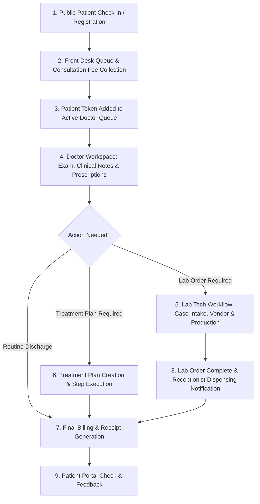

# End-to-End (E2E) Master Testing Plan
## SmileCare Dental Management System

This document provides a complete, step-by-step End-to-End Testing Plan to validate the entire workflow of the system from initial user onboarding and patient check-in to clinical consultation, lab order production, treatment planning, billing, and follow-up dispensing.

---

## 📋 System User Roles & Test Credentials

| Role | Username / Identifier | Default Password | Primary Dashboard |
| :--- | :--- | :--- | :--- |
| **Admin** | `admin` | `admin123` | `/admin` |
| **Frontdesk / Receptionist** | Registered Staff (Role: `Front Desk` or `Receptionist`) | Staff Password | `/frontdesk` |
| **Doctor / Dentist** | Registered Staff (Role: `Doctor`) | Staff Password | `/doctor` |
| **Lab Technician** | Registered Staff (Role: `Lab Tech`) | Staff Password | `/labtechnicians` |
| **Accountant** | Registered Staff (Role: `Accountant`) | Staff Password | `/frontdesk` (Accountant View) |
| **Patient** | Patient Token (e.g. `P-1001`) / Phone Number | N/A (Token login) | `/patient/dashboard` |

---

## 🔄 End-to-End Flow Summary Diagram

---

## 🧪 Detailed Test Suites

### Test Suite 1: Admin Setup & Clinic Configuration
**Objective**: Ensure the system settings, tariffs, lab catalog, and staff credentials are ready.

| Step | Action | Expected Result | Pass/Fail |
| :---: | :--- | :--- | :---: |
| **1.1** | Log in as **Admin** (`admin` / `admin123`) at `/login`. | Successfully redirected to `/admin` dashboard. | [ ] |
| **1.2** | Navigate to **User Management** and create staff accounts for: Doctor, Receptionist, Lab Tech, Accountant. | Users created with active status and assigned roles. | [ ] |
| **1.3** | Go to **Clinic Settings** / Tariff configuration and adjust consultation fees (e.g. General Fee: ₹500). | Tariffs updated and saved. | [ ] |
| **1.4** | Check **Lab Vendor & Pricing Catalog** to ensure default vendors (e.g. Apex Dental) and prices are listed. | Vendors and item prices load correctly. | [ ] |

---

### Test Suite 2: Patient Registration, Appointment & Kiosk Check-In
**Objective**: Test how new or returning patients enter the system.

| Step | Action | Expected Result | Pass/Fail |
| :---: | :--- | :--- | :---: |
| **2.1** | Open Public Portal (`/`) or Kiosk Check-in (`/patient/check-in`). | Check-in form loads with options for Token or New Registration. | [ ] |
| **2.2** | Register a new patient (Name: "John Doe", Phone: `9876543210`, Symptom: "Severe tooth pain"). | System generates a unique Patient Token (e.g., `P-1001`). | [ ] |
| **2.3** | Check-in with the generated token (`P-1001`). Select doctor and consultation type. | Confirmation screen displays appointment token and queue position. | [ ] |

---

### Test Suite 3: Front Desk Queue Management & Consultation Payment
**Objective**: Process patient intake and collect initial consultation fees.

| Step | Action | Expected Result | Pass/Fail |
| :---: | :--- | :--- | :---: |
| **3.1** | Log in as **Frontdesk** and open `/frontdesk` queue dashboard. | Newly checked-in patient `P-1001` appears in the "Unassigned" or "Pending Payment" queue. | [ ] |
| **3.2** | Click **Collect Consultation Fee** for `P-1001` (Amount: ₹500, Method: Cash). | Payment completes, receipt is generated, and patient status updates to **Paid / Waiting for Doctor**. | [ ] |
| **3.3** | Assign patient `P-1001` to an active Doctor. | Patient appears in the designated Doctor's live workspace queue. | [ ] |

---

### Test Suite 4: Doctor Workspace & Clinical Consultation
**Objective**: Validate clinical notes, prescription generation, and lab order creation.

| Step | Action | Expected Result | Pass/Fail |
| :---: | :--- | :--- | :---: |
| **4.1** | Log in as **Doctor** and open `/doctor` workspace. | Patient `P-1001` is visible in the active waiting list. | [ ] |
| **4.2** | Click **Call Patient** / Start Consultation. | Consultation banner opens showing patient medical history and chief complaints. | [ ] |
| **4.3** | Fill in **Clinical Notes** (Diagnosis: Irreversible Pulpitis, Tooth #36). Add **Prescription** (Amoxicillin 500mg, Paracetamol 650mg). | Notes and prescriptions saved to patient timeline. | [ ] |
| **4.4** | Click **Create Lab Order** (Category: Prosthetic, Case: Zirconia Crown, Tooth: #36, Priority: High, Expected Date: +5 Days). | Lab order created with status `submitted`. | [ ] |
| **4.5** | Click **Create Treatment Plan** (Multi-visit Root Canal Treatment + Crown Placement). | Treatment plan created with steps marked as "Pending". | [ ] |
| **4.6** | Click **Complete Consultation**. | Patient state updates to "Completed" and queue clears for next patient. | [ ] |

---

### Test Suite 5: Lab Technician Production Workflow
**Objective**: Track lab order processing, vendor dispatch, and case completion.

| Step | Action | Expected Result | Pass/Fail |
| :---: | :--- | :--- | :---: |
| **5.1** | Log in as **Lab Tech** and open `/labtechnicians` dashboard. | Lab order for `P-1001` (Zirconia Crown) appears in "New Cases" / "Submitted" tab. | [ ] |
| **5.2** | Click **Claim Order** / Assign Vendor (Select "Apex Dental Laboratories", Tracking #: `TRK-8899`). | Case moves to "In Progress / Dispatched" status. | [ ] |
| **5.3** | Add internal technical notes and upload/attach digital scan or result document. | File attachment and notes display in audit log. | [ ] |
| **5.4** | Mark Quality Control (QC) status as **Passed** and click **Mark Order Ready / Completed**. | Case status changes to `Ready for Pickup` / `Completed`. | [ ] |

---

### Test Suite 6: Receptionist Dispensing & Patient Notification
**Objective**: Test notification to receptionist and patient order collection.

| Step | Action | Expected Result | Pass/Fail |
| :---: | :--- | :--- | :---: |
| **6.1** | Log in as **Receptionist** and open `/patient/dispensing` or `/frontdesk`. | Notification alert indicates Lab Order for `P-1001` is **Ready for Pickup**. | [ ] |
| **6.2** | Click **Notify Patient** (Log SMS / Call note: "Called John Doe to pick up crown"). | Timestamp and notification note recorded cleanly without errors. | [ ] |
| **6.3** | When patient arrives, click **Dispense / Complete Delivery**. | Order status updates to "Dispensed to Patient". | [ ] |

---

### Test Suite 7: Billing, Payment & Financial Reconciliation
**Objective**: Validate invoicing, payment settlement, and daily cashier reconciliation.

| Step | Action | Expected Result | Pass/Fail |
| :---: | :--- | :--- | :---: |
| **7.1** | Log in as **Accountant** or **Frontdesk** and open Billing requests. | Billing entry for treatment plan procedure + lab item cost is listed for `P-1001`. | [ ] |
| **7.2** | Process payment (e.g. ₹3,500 via UPI / Card) and click **Generate Invoice**. | Invoice generated with tax split, item details, and zero remaining balance. | [ ] |
| **7.3** | Open **Daily Cash Reconciliation** / Shift Report. | Total collections reflect the ₹500 consultation + ₹3,500 treatment fee. | [ ] |

---

### Test Suite 8: Support Ticket & Staff Leave Lifecycle
**Objective**: Verify internal support tickets and staff leave approvals.

| Step | Action | Expected Result | Pass/Fail |
| :---: | :--- | :--- | :---: |
| **8.1** | Log in as any staff member (Doctor / Frontdesk) and click **Support / Help**. | Support Portal modal opens smoothly. | [ ] |
| **8.2** | Create a new ticket (Subject: "[UI Bug] Navbar alignment", Body: "Testing issue reporting"). | Ticket created successfully with status **Pending**. | [ ] |
| **8.3** | Submit a **Leave Request** (Type: Casual Leave, Dates: Tomorrow). | Request submitted for supervisor approval. | [ ] |
| **8.4** | Log in as **Admin**, review support tickets under Admin Complaints, update status to **Resolved**. | Status changes to Resolved; submitter can view resolution log and reopen if needed. | [ ] |
| **8.5** | As **Admin**, navigate to Staff Leaves and click **Approve Leave**. | Leave request approved and reflected in Navbar notifications. | [ ] |

---

## 🎯 Verification Checklist

- [x] **No 500 Internal Server Errors** on API requests.
- [x] **Real-time reloading** works for active queues and notifications.
- [x] **Audit trail entries** recorded for all lab status changes and support tickets.
- [x] **Token logins** function smoothly for patient portal access.
